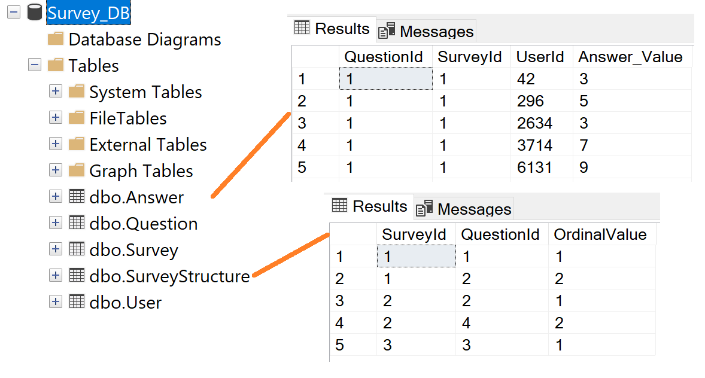
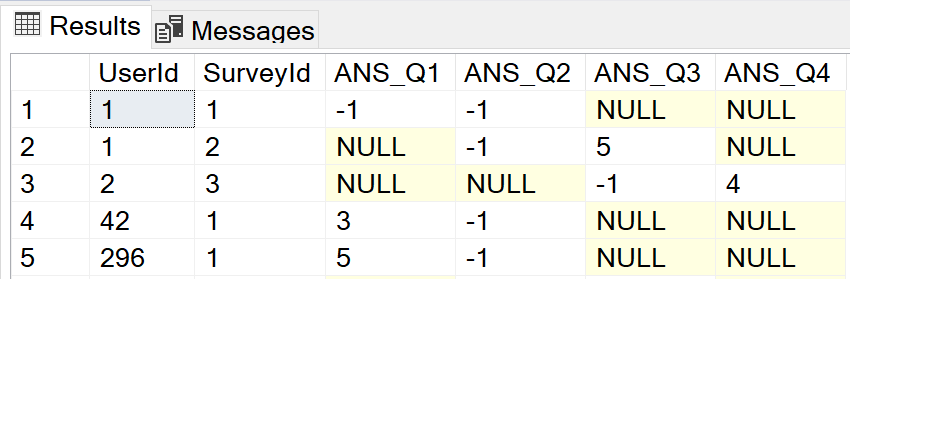

# Python-to-MS-SQL-server
Pilote pyodbc package to execute/send queries and retrieve data. 

The aim of this tutorial is to use pyodbc package to send a request to the server in order to retrieve  data into a pivot table from the data in *Survey_DB* database based on the *rules* defined in a table called *SurveyStructure*. 

Second purpose is to create a trigger in the python program running behind which update the extracted information each time there is an update of the dababase structure.

The python app will save  the last survey structure and the extracted table as .csv files in a folder.

# Database backup in the MS SQL server : 
A dummy survey_DB (for illustration purpose only) contains tables **Survey, SurveyStructure, Question, Answer** and **User**. Features  of the tables at a glance : 

- Answer table : QuestionId, SurveyId, UserId, Answer_Value <br>

 *This table is the key table that describes the survey structure based on which we can extract the data.* 
```java
SELECT TOP (1000) [QuestionId]
      ,[SurveyId]
      ,[UserId]
      ,[Answer_Value]
  FROM [Survey_DB].[dbo].[Answer]
  ```
  - SurveyStructure: SurveyId, QuestionId, OrdinalValue
```java
SELECT TOP (1000) [SurveyId]
      ,[QuestionId]
      ,[OrdinalValue]
  FROM [Survey_Sample_A19].[dbo].[SurveyStructure]
  ```
 
  
 *and other tables with their columns :*  
- Survey table:  QuestionId, SurveyId, UserId, Answer_Value
- Question table : QuestionId, Question_Text (there are 4 questions i the survey)  
- User table : UserId, User_Name, User_Email

We want to extract the data embedding the following information :
```java
SELECT TOP (1000) [UserId]
      ,[SurveyId]
      ,[ANS_Q1]
      ,[ANS_Q2]
      ,[ANS_Q3]
      ,[ANS_Q4]
  FROM [Survey_DB].[dbo].[SurveyData]
```


*NULL* value indicates the *questionID* does NOT exist in the *SurveyID* and the value "-1" means it does but the *User* does NOT answer to the question. Reminder : the rules are given in the *SurveyStructure* table !

...and save the extracted table into a .csv file


**You must download the code python and compile the main file (init) to run the application. <br>
The core python file contains the extract data function and the trigger function which updates all the modification of the *SurveyStructure* and save the last version into a .csv file. <br>
The extracted data keep also updated following any change of the *SurveyStructure* update. The data is automatically saved into a .csv file.**

Finally, demo with *jupyter notebook*.


